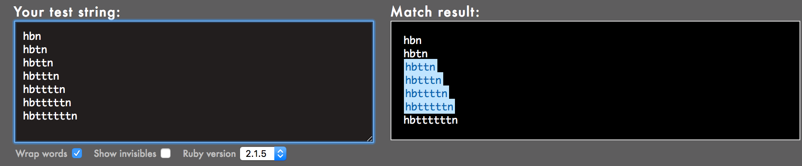

# Concepts

*For this project, we expect you to look at this concept:*

- [Regular Expression](https://intranet.alxswe.com/concepts/29)

# Background Context
For this project, you have to build your regular expression using Oniguruma, a regular expression library that which is used by Ruby by default. Note that other regular expression libraries sometimes have different properties.

Because the focus of this exercise is to play with regular expressions (regex), here is the Ruby code that you should use, just replace the regexp part, meaning the code in between the `//`:

```bash
sylvain@ubuntu$ cat example.rb
#!/usr/bin/env ruby
puts ARGV[0].scan(/127.0.0.[0-9]/).join
sylvain@ubuntu$
sylvain@ubuntu$ ./example.rb 127.0.0.2
127.0.0.2
sylvain@ubuntu$ ./example.rb 127.0.0.1
127.0.0.1
sylvain@ubuntu$ ./example.rb 127.0.0.a
```

# Resources

**Read or watch:**
- [Regular expressions - basics](https://www.slideshare.net/slideshow/introducing-regular-expressions/63676155)
- [Regular expressions - advanced](https://www.slideshare.net/slideshow/advanced-regular-expressions-80296518/80296518)
- [Rubular is your best friend](https://rubular.com/)
- [Use a regular expression against a problem: now you have 2 problems](https://blog.codinghorror.com/regular-expressions-now-you-have-two-problems/)
- [Learn Regular Expressions with simple, interactive exercises](https://regexone.com/)

# Requirements

## General
- Allowed editors: `vi`, `vim`, `emacs`
- All your files will be interpreted on Ubuntu 20.04 LTS
- All your files should end with a new line
- A `README.md` file, at the root of the folder of the project, is mandatory
- All your Bash script files must be executable
- The first line of all your Bash scripts should be exactly `#!/usr/bin/env ruby`
- All your regex must be built for the Oniguruma library

## Quiz questions

### Question #0

What is the `/school/` regexp matching?

- [ ] schoOl

- [ ] School

- [ ] school

### Question #1

What is the `/Scho.l/` regexp matching?

- [ ] Scho.l

- [ ] School

- [ ] school

### Question #2

What is the `/Scho*l/` regexp matching?

- [ ] Schoool

- [ ] Scho.l

- [ ] Schoo.l

## Tasks

### 0. Simply matching School


Requirements:

- The regular expression must match `School`
- Using the project instructions, create a Ruby script that accepts one argument and pass it to a regular expression matching method

Example:

```bash
sylvain@ubuntu$ ./0-simply_match_school.rb School | cat -e
School$
sylvain@ubuntu$ ./0-simply_match_school.rb "Best School" | cat -e
School$
sylvain@ubuntu$ ./0-simply_match_school.rb "School Best School" | cat -e
SchoolSchool$
sylvain@ubuntu$ ./0-simply_match_school.rb "Grace Hopper" | cat -e
$
```

**Repo:**
- GitHub repository: `alx-system_engineering-devops`
- Directory: `0x06-regular_expressions`
- File: `0-simply_match_school.rb`

### 1. Repetition Token #0



Requirements:

- Find the regular expression that will match the above cases
- Using the project instructions, create a Ruby script that accepts one argument and pass it to a regular expression matching method

**Repo:**
- GitHub repository: `alx-system_engineering-devops`
- Directory: `0x06-regular_expressions`
- File: `1-repetition_token_0.rb`

### 2. Repetition Token #1


Requirements:

- Find the regular expression that will match the above cases
- Using the project instructions, create a Ruby script that accepts one argument and pass it to a regular expression matching method

**Repo:**
- GitHub repository: `alx-system_engineering-devops`
- Directory: `0x06-regular_expressions`
- File: `2-repetition_token_1.rb`

### 3. Repetition Token #2


Requirements:

- Find the regular expression that will match the above cases
- Using the project instructions, create a Ruby script that accepts one argument and pass it to a regular expression matching method

**Repo:**
- GitHub repository: `alx-system_engineering-devops`
- Directory: `0x06-regular_expressions`
- File: `3-repetition_token_2.rb`

### 4. Repetition Token #3


Requirements:

- Find the regular expression that will match the above cases
- Using the project instructions, create a Ruby script that accepts one argument and pass it to a regular expression matching method
- Your regex should not contain square brackets

**Repo:**
- GitHub repository: `alx-system_engineering-devops`
- Directory: `0x06-regular_expressions`
- File: `4-repetition_token_3.rb`

### 5. Not quite HBTN yet

Requirements:

- The regular expression must be exactly matching a string that starts with `h` ends with `n` and can have any single character in between
- Using the project instructions, create a Ruby script that accepts one argument and pass it to a regular expression matching method

Example:

```bash
sylvain@ubuntu$ ./5-beginning_and_end.rb 'hn' | cat -e
$
sylvain@ubuntu$ ./5-beginning_and_end.rb 'hbn' | cat -e
hbn$
sylvain@ubuntu$ ./5-beginning_and_end.rb 'hbtn' | cat -e
$
sylvain@ubuntu$ ./5-beginning_and_end.rb 'h8n' | cat -e
h8n$
sylvain@ubuntu$
$
```

**Repo:**
- GitHub repository: `alx-system_engineering-devops`
- Directory: `0x06-regular_expressions`
- File: `5-beginning_and_end.rb`

### 6. Call me maybe

This task is brought to you by a professional advisor [Neha Jain](https://x.com/_nehajain), Senior Software Engineer at LinkedIn.

Requirement:

- The regular expression must match a 10 digit phone number

Example:

```bash
sylvain@ubuntu$ ./6-phone_number.rb 4155049898 | cat -e
4155049898$
sylvain@ubuntu$ ./6-phone_number.rb " 4155049898" | cat -e
$
sylvain@ubuntu$ ./6-phone_number.rb "415 504 9898" | cat -e
$
sylvain@ubuntu$ ./6-phone_number.rb "415-504-9898" | cat -e
$
sylvain@ubuntu$
```

**Repo:**
- GitHub repository: `alx-system_engineering-devops`
- Directory: `0x06-regular_expressions`
- File: `6-phone_number.rb`

### 7. OMG WHY ARE YOU SHOUTING?


Requirement:

- The regular expression must be only matching: capital letters

Example:

```bash
sylvain@ubuntu$ ./7-OMG_WHY_ARE_YOU_SHOUTING.rb "I realLy hOpe VancouvEr posseSs Yummy Soft vAnilla Dupper Mint Ice Nutella cream" | cat -e
ILOVESYSADMIN$
sylvain@ubuntu$ ./7-OMG_WHY_ARE_YOU_SHOUTING.rb "WHAT do you SAY?" | cat -e
WHATSAY$
sylvain@ubuntu$ ./7-OMG_WHY_ARE_YOU_SHOUTING.rb "cannot read you" | cat -e
$
sylvain@ubuntu$
```

**Repo:**
- GitHub repository: `alx-system_engineering-devops`
- Directory: `0x06-regular_expressions`
- File: `7-OMG_WHY_ARE_YOU_SHOUTING.rb`

### 8. Textme

This exercise was prepared for you by [Guillaume Plessis](https://www.linkedin.com/in/gplessis/), VP of Infrastructure at TextMe. It is something he uses daily. You can thank Guillaume for his project [on Twitter](https://x.com/gui).

For this task, you’ll be taking over Guillaume’s responsibilities: one afternoon, a TextMe VoIP Engineer comes to you and explains she wants to run some statistics on the TextMe app text messages transactions.

Requirements:

- Your script should output: `[SENDER],[RECEIVER],[FLAGS]`
    - The sender phone number or name (including country code if present)
    - The receiver phone number or name (including country code if present)
    - The flags that were used

You can find a [[log file here]](http://intranet-projects-files.s3.amazonaws.com/holbertonschool-sysadmin_devops/78/text_messages.log).

Example:

```bash
$ ./100-textme.rb 'Feb 1 11:00:00 ip-10-0-0-11 mdr: 2016-02-01 11:00:00 Receive SMS [SMSC:SYBASE1] [SVC:] [ACT:] [BINF:] [FID:] [from:Google] [to:+16474951758] [flags:-1:0:-1:0:-1] [msg:127:This planet has - or rather had - a problem, which was this: most of the people on it were unhappy for pretty much of the time.] [udh:0:]'
Google,+16474951758,-1:0:-1:0:-1
$
$
$ ./100-textme.rb 'Feb 1 11:00:00 ip-10-0-64-10 mdr: 2016-02-01 11:00:00 Receive SMS [SMSC:SYBASE2] [SVC:] [ACT:] [BINF:] [FID:] [from:+17272713208] [to:+19172319348] [flags:-1:0:-1:0:-1] [msg:136:Orbiting this at a distance of roughly ninety-two million miles is an utterly insignificant little blue green planet whose ape-descended] [udh:0:]'
+17272713208,+19172319348,-1:0:-1:0:-1
$
$ ./100-textme.rb 'Feb 1 11:00:00 ip-10-0-64-11 mdr: 2016-02-01 11:00:00 Sent SMS [SMSC:SYBASE1] [SVC:backendtextme] [ACT:] [BINF:] [FID:] [from:18572406905] [to:14022180266] [flags:-1:0:-1:-1:-1] [msg:136:Far out in the uncharted backwaters of the unfashionable end of the western spiral arm of the Galaxy lies a small unregarded yellow sun.] [udh:0:]'
18572406905,14022180266,-1:0:-1:-1:-1
$
$
$ ./100-textme.rb 'Feb 1 11:00:00 ip-10-0-64-11 mdr: 2016-02-01 11:00:00 Sent SMS [SMSC:SYBASE1] [SVC:backendtextme] [ACT:] [BINF:] [FID:] [from:12392190384] [to:19148265919] [flags:-1:0:-1:-1:-1] [msg:99:life forms are so amazingly primitive that they still think digital watches are a pretty neat idea.] [udh:0:]'
12392190384,19148265919,-1:0:-1:-1:-1
$
```

**Repo:**
- GitHub repository: `alx-system_engineering-devops`
- Directory: `0x06-regular_expressions`
- File: `100-textme.rb`
